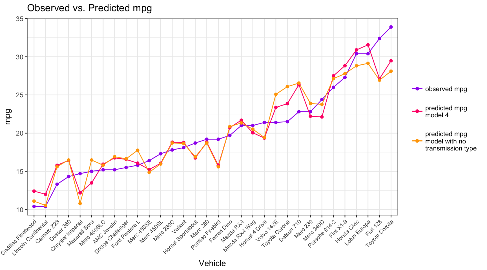

[**CLICK HERE**](https://reyvaz.github.io/Analyzing-Rs-mtcars/mt_cars_lm.html)
to see the report in rendered html

## The Effects of Automatic and Manual Transmissions on Fuel Efficiency

This is an analysis of the R dataset mtcars to explore the relationship between car fuel efficiency, specified as miles per gallon (mpg), and the type of transmission, i.e. automatic or manual. The data was originally extracted from the 1974 Motor Trend US magazine, and comprises fuel consumption and 10 aspects of automobile design and performance for 32 1973–74 models.   

This analysis finds a significant relationship between mpg and the type of transmission. Specifically, manual transmission cars are associated with higher mpg (i.e. better efficiency). However, there are confounding factors that affect this relationship. For example, automatic cars are associated with higher weight and larger engines, which also affect efficiency. The relationship between efficiency and type of transmission is robust to different specifications.

The data is available in the R datasets. It was accessed for this analysis on April 4, 2017. 

* The rendered html version of the analysis can be found [here](https://reyvaz.github.io/Analyzing-Rs-mtcars/mt_cars_lm.html).   

* To recreate the entire report simply run the [mt_cars_lm.Rmd](mt_cars_lm.Rmd) script. 

[GitHub Pages Link](https://reyvaz.github.io/Analyzing-Rs-mtcars/)  

 

 
